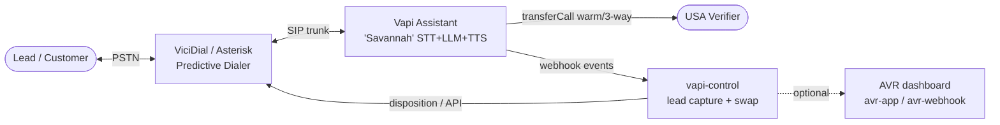
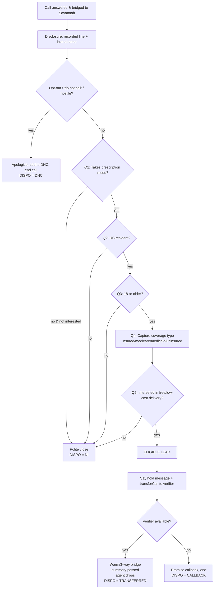
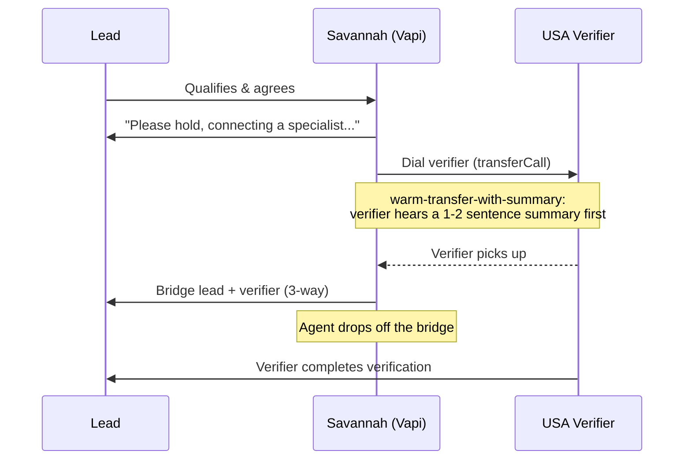
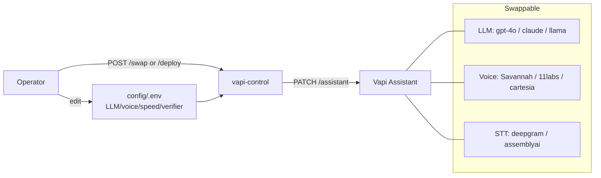

# Call-Flow Flowcharts

You asked for something to guide the flow design. These are **Mermaid** diagrams — they render
automatically on GitHub, and you can edit/export them at <https://mermaid.live> (paste the code,
then download PNG/SVG). For a drag-and-drop canvas, [draw.io](https://draw.io) can import Mermaid too.

---

## 1) High-level system

---

## 2) Conversation & qualification logic (the campaign brain)

---

## 3) The 3-way / warm transfer detail

---

## 4) Provider / voice swap path (ops view)

> Tip: keep this file open while you design. Change a node, paste into mermaid.live, export the image
> for your SOP/training docs.
